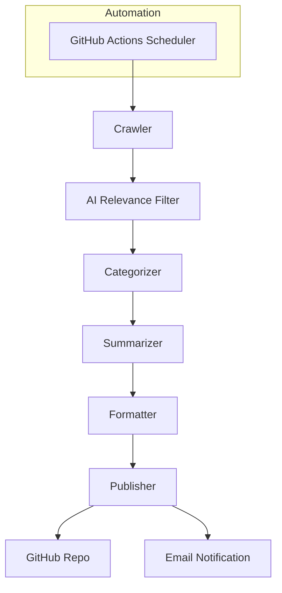

# AI Trending Topics Crawler & Publisher

## Overview
This project is an automated Python system that crawls the top 10 trending AI topics per category from X.com (Twitter), summarizes and categorizes them, and publishes a daily markdown newsletter to the `AI-newsletter` folder and your GitHub repository. Each day's file is named `<date>-ai-newsletter.md`.

**Key Features:**
- Crawls trending AI topics and categorizes them (e.g., AI prompts, AI agents, AI MCP servers, AI models, AI resources)
- Summarizes and formats results in both JSON and Markdown
- Saves daily newsletters in `AI-newsletter/` with date-based filenames
- Publishes newsletters to your GitHub repository (requires credentials)
- Modular, testable Python codebase
- Logging for all workflow steps and errors
- (Optional) Error notification hooks for failures
- Fully automated via GitHub Actions (runs daily, sends email notification)

---

## Architecture



---

## Setup Instructions

### 1. Clone the Repository
```bash
git clone https://github.com/snowan/AI-trending-topics-crawler-and-publisher.git
cd AI-trending-topics-crawler-and-publisher
```

### 2. Local Development
- Create and activate a virtual environment:
  ```bash
  python3 -m venv venv
  source venv/bin/activate
  ```
- Install dependencies:
  ```bash
  pip install -r requirements.txt
  ```
- Create a `.env` file (not committed to git):
  ```env
  X_BEARER_TOKEN=your_x_bearer_token
  GH_TOKEN=your_github_token
  # Optional: override defaults
  # GH_REPO=snowan/AI-trending-topics-crawler-and-publisher
  # GH_BRANCH=main
  # AI_CATEGORIES=AI prompts,AI agents,AI MCP servers,AI models,AI resources
  # EMAIL_TO=your@email.com
  # EMAIL_USERNAME=your@email.com
  # EMAIL_PASSWORD=your_email_app_password
  ```
- Run the workflow:
  ```bash
  python main.py
  ```

### 3. GitHub Actions Automation
- Add the following secrets in your GitHub repo settings:
  - `X_BEARER_TOKEN`
  - `GH_TOKEN`
  - `GH_REPO` (optional, defaults to this repo)
  - `GH_BRANCH` (optional, defaults to `main`)
  - `AI_CATEGORIES` (optional)
  - `EMAIL_TO`, `EMAIL_USERNAME`, `EMAIL_PASSWORD` (for notifications)
- The workflow runs daily at 8am UTC and on manual dispatch.
- You will receive an email notification on completion.

---

## Usage
- The newsletter is saved in `AI-newsletter/<date>-ai-newsletter.md` and pushed to your repo.
- Categories and filtering can be customized via environment variables.
- All steps and errors are logged to the console and GitHub Actions logs.

---

## Environment Variables
| Variable              | Description                                      | Default/Required                      |
|-----------------------|--------------------------------------------------|---------------------------------------|
| X_BEARER_TOKEN        | Twitter/X API Bearer Token                        | Required                              |
| GH_TOKEN              | GitHub Personal Access Token                      | Required                              |
| GH_REPO               | GitHub repo (e.g. user/repo)                      | snowan/AI-trending-topics-crawler-and-publisher |
| GH_BRANCH             | GitHub branch to commit to                        | main                                  |
| AI_CATEGORIES         | Comma-separated list of categories                 | AI prompts,AI agents,AI MCP servers,AI models,AI resources |
| NEWSLETTER_OUTPUT_DIR | Output folder for newsletters                      | AI-newsletter                         |
| EMAIL_TO              | Email address for notifications                    | Optional                              |
| EMAIL_USERNAME        | SMTP username (email)                              | Optional                              |
| EMAIL_PASSWORD        | SMTP password or app password                      | Optional                              |

---

## Workflow Description
1. **Crawler**: Fetches trending tweets about AI from X.com using the API.
2. **AI Relevance Filter**: Filters out tweets not truly about AI using keywords (and optionally spaCy or OpenAI LLM).
3. **Categorizer**: Assigns each topic to a category (configurable).
4. **Summarizer**: Generates a concise title for each topic.
5. **Formatter**: Formats the output as Markdown and JSON.
6. **Publisher**: Saves the newsletter and pushes it to GitHub.
7. **Notification**: Sends an email on workflow completion (if configured).
8. **Automation**: GitHub Actions runs the workflow daily and on demand.

---

## Testing
- All unit tests are in the `tests/` directory.
- Run tests with:
  ```bash
  pytest tests/
  ```

---

## Contributing
Pull requests are welcome! For major changes, please open an issue first to discuss what you would like to change.

---

## License
[MIT](LICENSE)
